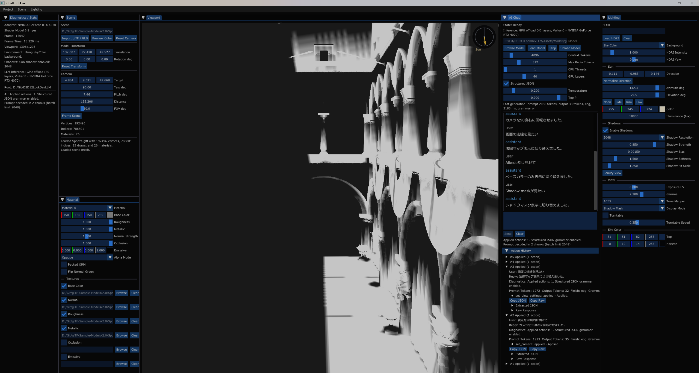

# LookDev Rendering Notes

English version: [lookdev-rendering.md](lookdev-rendering.md)

このドキュメントでは、v1.2 時点の描画確認向け LookDev 機能と、それを確認するための UI をまとめます。

## Main View

メイン viewport では、glTF/GLB の PBR model、HDR IBL、Sun lighting、docking ImGui layout、AI Chat panel を同時に扱います。Lighting panel には HDRI、Sun、shadow、view、sky color の操作を集約しています。

## UI Readability

既定の ImGui UI font は 18 px、AI Chat font は 22 px です。`Project > UI Settings` は project file や docking layout とは別に、per-user の読みやすさ設定を `ui.user.json` へ保存します。font size、UI scale、padding の変更は次回起動時に反映され、chat transcript height は即時反映されます。

## Display Modes

Lighting panel の Display Mode combo で、PBR shader の出力を Beauty と debug view の間で切り替えられます。Normal view は tangent-space normal map 適用後の最終 shading normal を可視化するため、tangent や normal map の問題を確認しやすくなります。

Base Color view は lighting を掛けずに imported albedo と material assignment を表示するため、glTF texture binding の確認に使えます。

Shadow Mask view は Sun shadow visibility を可視化します。白い領域は direct Sun lighting を受け、暗い領域は shadow map によって減衰します。

## Sun Shadows

v1.2 では単一の orthographic Sun shadow map を追加しています。shadow map は model transform 後の scene bounds に fit し、direct Sun lighting にだけ適用します。IBL、emissive、sky rendering には shadow を掛けません。

Shadows section では次を操作できます。

- Enable Shadows
- Shadow Resolution: `1024`、`2048`、`4096`
- Shadow Strength
- Shadow Bias
- Shadow Softness
- Shadow Fit Scale
- Shadow Mask View / Beauty View quick toggle

Alpha Mask material は shadow depth pixel shader で cutout shadow を落とします。Blend material は v1.2 では shadow caster から除外しています。

## Sun Direction UI

Sun section には vector と angle の両方の操作を用意しています。

- `Direction`: 直接の XYZ light-ray vector。
- `Azimuth deg` / `Elevation deg`: 人間が理解しやすい sun-source direction。
- `Noon`、`Side`、`Rim`、`Low`: 簡易プリセット。

Viewport 右上には小さな Sun direction overlay も表示します。camera-relative な表示なので、scene 内に大きな helper object を置かずに、太陽がどちらから来ているかを確認できます。

## Camera UI

Scene panel では camera target、yaw、pitch、distance、FOV を操作できます。`Frame Scene` は読み込んだ glTF/GLB または preview mesh に camera を fit し、`Front`、`Back`、`Left`、`Right`、`Top`、`Bottom`、`Iso` は scene-framed な定番 view preset を適用します。

Viewport には FOV、distance、yaw/pitch、target を示す compact な camera overlay を表示できます。3 つの camera bookmark slot に作業中の view を保存/復元でき、bookmark は project JSON に保存します。

## AI Actions

chat action system は、ImGui control と同じ render state を変更できます。view settings、Sun settings、shadow settings、material parameters、camera、camera preset/bookmark、model transform が対象です。実際に renderer へ反映する前に、UI 側で各 action を validation します。
